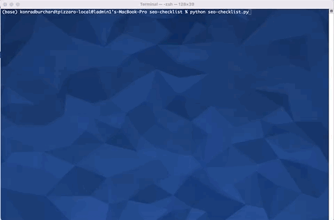

# technical-seo-checklist
This automated technical SEO checklist will help you check your on-page SEO in a few minutes.


Work in progress.

# SEO Checks

- Mobile Friendly
- Bot Accessibility
- Indexation Status
- Robots meta tag
- X Robots tag
- Canonicals
- Schema (**WIP**)
- Core Web Vitals

## Usage

Open the terminal and run the following: 

```zsh
python seo-checklist.py
```

## Contributing

Pull requests are welcome. 


# Demo

